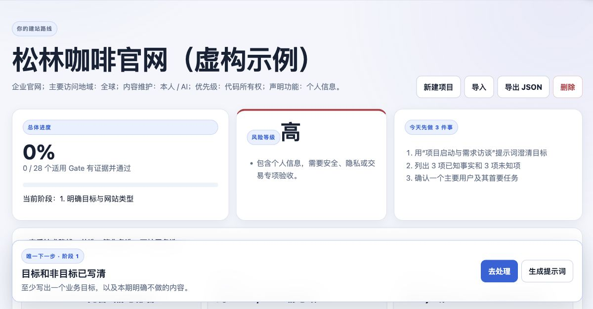
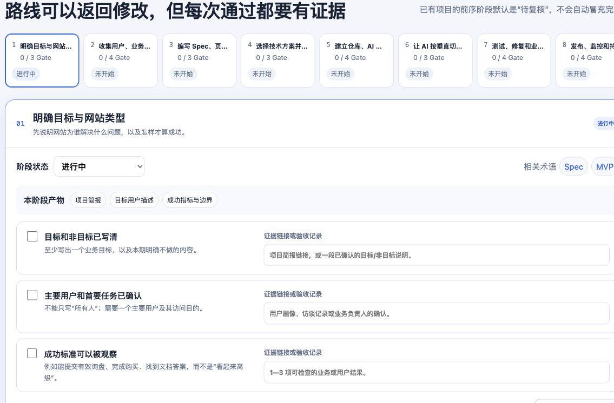

# AI 建站向导：6 问生成网站规划、开发与部署路线

## AI Website Roadmap Builder: Plan, Build, Test, and Deploy

一个本地优先的交互式 AI 建站路线生成器：回答 6 个问题，获得从需求规划、技术选型、开发测试到部署上线的 8 阶段执行路线。

A local-first, interactive AI website roadmap builder: answer six questions to get an eight-stage path from requirements and technology choices through development, testing, and deployment.

[](https://github.com/whitedew77/ai-website-guide/actions/workflows/ci.yml)

[在线使用 AI 建站向导 / Open the live AI Website Guide](https://whitedew77.github.io/ai-website-guide/)

[图文快速上手 / Visual quick start](#图文快速上手--visual-quick-start) · [中文](#中文) · [English](#english)

## 图文快速上手 / Visual quick start

> 以下截图来自本项目的实际运行界面，不是概念图或 AI 生成图。示例项目“松林咖啡官网（虚构示例）”完全虚构，不包含真实客户或个人资料。
>
> These are screenshots of the working application, not concept art or AI-generated mockups. “Pine Grove Coffee Website (fictional example)” is entirely fictional and contains no real customer or personal data.

### 1. 从首页创建计划 / Start a plan from the home screen

打开[在线版](https://whitedew77.github.io/ai-website-guide/)，选择“创建新网站计划”。也可以先浏览技术、术语和 Skills 知识库。

Open the [live application](https://whitedew77.github.io/ai-website-guide/) and choose “创建新网站计划” (Create a new website plan). You can also browse the technology, terminology, and Skills libraries first.


### 2. 回答 6 个问题 / Answer six questions

使用虚构或已脱敏的项目名称，依次选择网站类型、当前起点、高风险功能、内容维护者、访问地域和首要目标。

Use a fictional or sanitized project name, then choose the website type, starting point, high-risk features, content owner, visitor region, and top priority.


### 3. 查看生成的路线 / Review the generated roadmap

系统会给出总体进度、风险等级、今天先做的三件事，以及首选、简化和可扩展技术路线。技术建议是工程判断，不是适用于所有项目的固定答案。

The application shows overall progress, risk level, three immediate actions, and primary, simpler, and scalable technology paths. Technology suggestions are engineering judgments, not universal answers.



### 4. 用证据通过每个 Gate / Pass each gate with evidence

路线分为 8 个阶段。每个适用 Gate 都要填写证据链接或验收记录，再由人明确确认；只勾选完成不算通过。

The roadmap has eight stages. Every applicable gate needs an evidence link or acceptance note plus explicit human confirmation; checking a box alone is not enough.



### 5. 生成下一步提示词 / Generate the next-step prompt

提示词生成器会把项目背景、当前阶段和未知项组合成可复制或下载的 Markdown。不要输入 API Key、密码、Token、真实客户个人信息或未获授权的内部资料。

The prompt generator combines project context, the current stage, and unknowns into copyable or downloadable Markdown. Never enter API keys, passwords, tokens, real customer personal data, or unauthorized internal material.


完成一轮后，请在“我的路线”中导出 JSON；项目数据默认只保存在当前浏览器，关闭网页不会立即丢失，但清理浏览器数据或换设备会丢失本地副本。

After a session, export JSON from “我的路线” (My Roadmap). Project data stays only in the current browser by default: closing the page does not immediately erase it, but clearing browser data or changing devices removes the local copy.

---

## 中文

一个面向零基础用户的本地优先交互式教程。它把“资料百科”整理成一条可以实际执行的路线：回答 6 个问题生成网站计划，按照 8 个阶段完成证据化质量 Gate，并随时使用提示词、技术与术语库以及经过人工审核的 GitHub Skill 目录。

> 当前网页界面和教程内容以简体中文为主；本 README 提供完整的中文与英文项目说明。

### 它适合谁

- 想借助 Codex 等 AI 工具制作网站，但不知道第一步做什么的人；
- 需要把需求、设计、开发、测试和上线串成可验收流程的人；
- 希望项目数据留在本机，并能够导入、导出和离线使用的人；
- 想了解 GitHub Skills、技术选型和常见建站术语，但不想直接运行未知安装命令的人。

### 核心内容

- **6 问创建计划**：根据网站类型、起点、风险功能、内容维护者、访问地区和优先级生成路线。
- **8 阶段证据 Gate**：每个 Gate 必须同时具备证据和人工确认，不能只勾选完成。
- **条件化路线**：网站类型、功能、地区和风险会增加约束，不用一套固定清单冒充所有项目。
- **提示词生成器**：把项目背景、阶段目标和未知信息组合成可继续追问的提示词。
- **技术与术语库**：保留直接来源和核对日期，区分事实、工程判断和非正式行业用语。
- **经审核的 Skill 目录**：只展示经过人工检查的公开 GitHub 来源，不自动安装、不自动升级推荐。
- **本地优先数据**：项目保存在当前浏览器，支持 JSON 导入导出，不需要账号或服务端数据库。
- **PWA 与离线版**：可生成静态 PWA，以及一个自包含的单文件离线快照。

### 快速开始

需要 Node.js 22.13 或更高版本。

```bash
npm ci
npm run dev
```

打开终端显示的本地地址后即可创建项目。项目仅保存在当前浏览器；换设备或清理浏览器数据前，请先使用页面中的“导出 JSON”。

### 构建与验证

```bash
npm test
npm run lint
npm run privacy:scan
```

完整测试会执行逻辑测试、生产构建、渲染与离线产物测试以及基础隐私扫描。构建会生成：

- 可直接托管的静态 PWA：`dist/client/`；
- 单文件离线快照：`public/offline.html`；
- 同步后的审核 Skill JSON；
- 仅供构建与测试使用的服务端产物和托管元数据。

自动隐私扫描是防护网，不是“绝对没有泄露”的证明。公开截图、示例、来源、提交历史和最终部署产物仍需人工复核。

### 主要目录

- `app/lib/workflow-content.ts`：六问、八阶段和提示词内容。
- `app/lib/knowledge.ts`：有直接来源和核对日期的技术与术语。
- `catalog/skills-reviewed.json`：人工审核后的 GitHub Skill 目录。
- `scripts/update-skill-metadata.mjs`：只读取白名单仓库元数据并生成评审报告。
- `public/tools/scan-local-skills.mjs`：用户可下载的本机只读发现脚本。
- `docs/CONTENT-AUDIT.md`：公开内容的删除、修正、来源和已知限制记录。
- `docs/MAINTENANCE.md`：更新、评分、隐私和发布边界。

### 数据与隐私边界

- 不建立账号，不把用户项目上传到公共服务器；
- 不在网页中执行安装命令或保存 GitHub Token；
- 不包含真实个人、公司、客户、测试数据或内部项目案例；
- 不把本机绝对路径、API Key、密码或访问令牌写入源码、示例和 Git 历史；
- 新发现的 Skill 只能先生成评审证据，不能自动变成推荐。

如需扫描项目专属敏感词，可设置逗号分隔的 `SOP_PRIVATE_TERMS`，或创建被 Git 忽略的 `.privacy-denylist.local`，每行填写一个词。

### 内容审核与已知限制

项目中的版本、价格、星数和维护状态都可能变化，不作为永久事实。目录更新自动化只创建元数据评审材料，不会自动修改人工审核后的推荐目录。

`main` 分支通过测试后，只会把静态产物 `dist/client/` 部署到 GitHub Pages；`dist/server/` 不会上传。自定义域名、分析统计、表单和公共用户数据收集仍需要单独决策与授权。详见 [`docs/CONTENT-AUDIT.md`](docs/CONTENT-AUDIT.md) 和 [`docs/MAINTENANCE.md`](docs/MAINTENANCE.md)。

### 许可证

- 软件源代码和软件资源采用 [MIT License](LICENSE)。
- 原创教程文字、文档、提示词内容和目录注释采用 [Creative Commons Attribution 4.0 International](LICENSE-CONTENT)。
- 第三方项目名称、商标、链接、引用和代码仍受各自权利人与许可证约束。

OpenAI 的归档仓库 [`openai/skills`](https://github.com/openai/skills) 不作为当前示例目录；当前公开示例主要从 [`openai/plugins`](https://github.com/openai/plugins) 等白名单仓库进行人工审核。

---

## English

A local-first, interactive guide for complete beginners. Instead of presenting a loose encyclopedia of resources, it turns website creation into an executable path: answer six questions to generate a plan, work through eight stages with evidence-based quality gates, and use the prompt generator, technology and terminology library, and manually reviewed GitHub Skill catalog when needed.

> The application interface and tutorial content are currently primarily in Simplified Chinese. This README provides a complete English description of the project.

### Who it is for

- People who want to build a website with Codex or other AI tools but do not know where to begin.
- People who need an auditable path connecting requirements, design, development, testing, and launch.
- People who want project data to remain on their own device, with import, export, and offline support.
- People who want to understand GitHub Skills, technology choices, and common website terminology without running unverified installation commands.

### What it includes

- **A six-question planning wizard:** generates a route from the website type, starting point, high-risk features, content owner, visitor region, and project priority.
- **Eight stages with evidence gates:** a gate passes only when it has both supporting evidence and explicit human confirmation.
- **Condition-aware routes:** website type, features, region, and risk add relevant constraints instead of forcing every project through one generic checklist.
- **Prompt generator:** combines project context, the current stage, and unresolved information into a prompt that can support the next conversation.
- **Technology and terminology library:** keeps direct sources and review dates while separating confirmed facts, engineering judgment, and informal industry language.
- **Reviewed Skill catalog:** lists only manually inspected public GitHub sources and never installs or automatically promotes a recommendation.
- **Local-first project data:** stores projects in the current browser, supports JSON import and export, and requires no account or server-side database.
- **PWA and offline edition:** produces a static progressive web app and a self-contained, single-file offline snapshot.

### Quick start

Node.js 22.13 or later is required.

```bash
npm ci
npm run dev
```

Open the local URL shown in the terminal and create a project. Project data stays in the current browser. Export the project as JSON before switching devices or clearing browser data.

### Build and verification

```bash
npm test
npm run lint
npm run privacy:scan
```

The full test command runs logic tests, a production build, rendered and offline artifact tests, and a baseline privacy scan. The build produces:

- a host-ready static PWA in `dist/client/`;
- a self-contained offline snapshot at `public/offline.html`;
- a synchronized copy of the reviewed Skill catalog;
- server artifacts and hosting metadata used only for building and testing.

Automated privacy scanning is a safety net, not proof that disclosure is impossible. Public screenshots, examples, sources, commit history, and final deployment artifacts still require human review.

### Project map

- `app/lib/workflow-content.ts`: the six questions, eight stages, and prompt content.
- `app/lib/knowledge.ts`: sourced technologies and terminology with review dates.
- `catalog/skills-reviewed.json`: the manually reviewed GitHub Skill catalog.
- `scripts/update-skill-metadata.mjs`: reads metadata from allowlisted repositories and creates a review report.
- `public/tools/scan-local-skills.mjs`: a downloadable, read-only local discovery script.
- `docs/CONTENT-AUDIT.md`: removals, corrections, sources, and known limitations for public content.
- `docs/MAINTENANCE.md`: update, scoring, privacy, and release boundaries.

### Data and privacy boundaries

- The project creates no user accounts and uploads no user projects to a public server.
- The website does not execute installation commands or store GitHub tokens.
- The repository contains no real personal, company, customer, test, or internal-project data.
- Machine-specific absolute paths, API keys, passwords, and access tokens must not appear in source code, examples, or Git history.
- Newly discovered Skills may produce review evidence, but they cannot become recommendations automatically.

To scan for project-specific sensitive terms, set the comma-separated `SOP_PRIVATE_TERMS` environment variable or create an ignored `.privacy-denylist.local` file with one term per line.

### Content review and known limitations

Versions, prices, star counts, and maintenance status can change and are not treated as permanent facts. Catalog automation creates metadata review material only; it does not modify the manually reviewed catalog by itself.

After `main` passes validation, GitHub Pages deploys only the static `dist/client/` output; `dist/server/` is never uploaded. Custom domains, analytics, forms, and collection of public user data require separate decisions and authorization. See [`docs/CONTENT-AUDIT.md`](docs/CONTENT-AUDIT.md) and [`docs/MAINTENANCE.md`](docs/MAINTENANCE.md).

### Licensing

- Software source code and software assets are available under the [MIT License](LICENSE).
- Original tutorial text, documentation, prompts, and catalog annotations are available under the [Creative Commons Attribution 4.0 International License](LICENSE-CONTENT).
- Third-party project names, trademarks, links, quotations, and code remain subject to their respective owners and licenses.

OpenAI's archived [`openai/skills`](https://github.com/openai/skills) repository is not used as the current example catalog. Current public examples are manually reviewed from allowlisted repositories such as [`openai/plugins`](https://github.com/openai/plugins).
